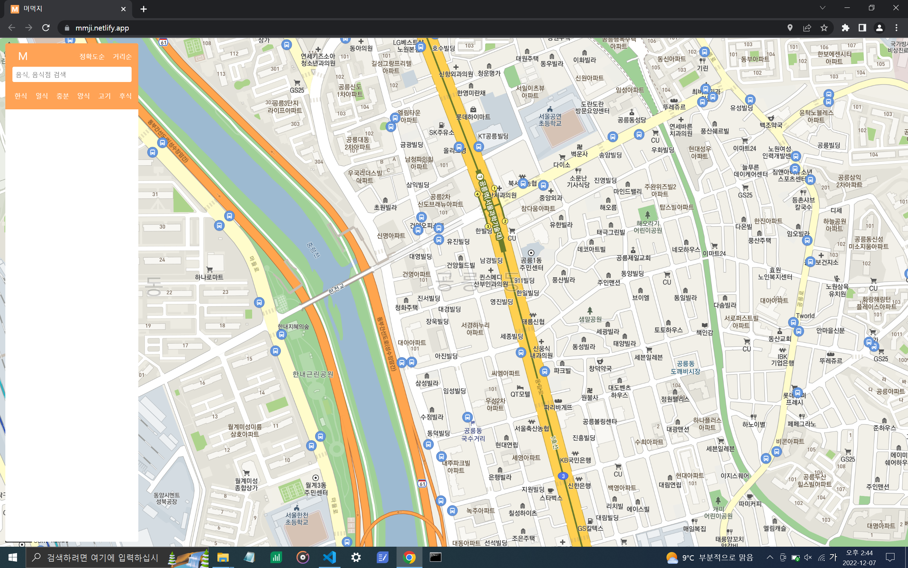
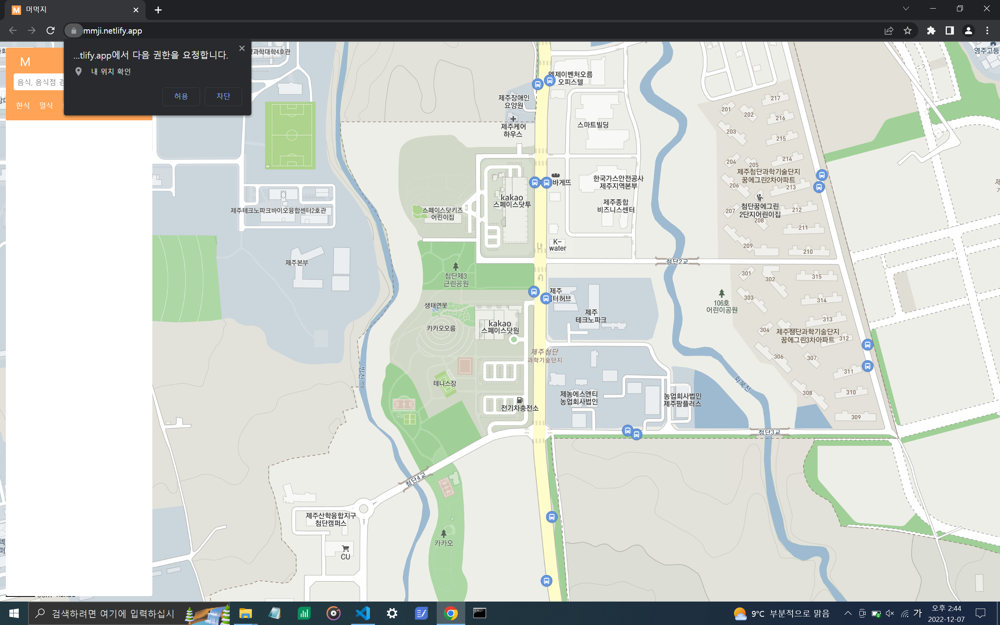
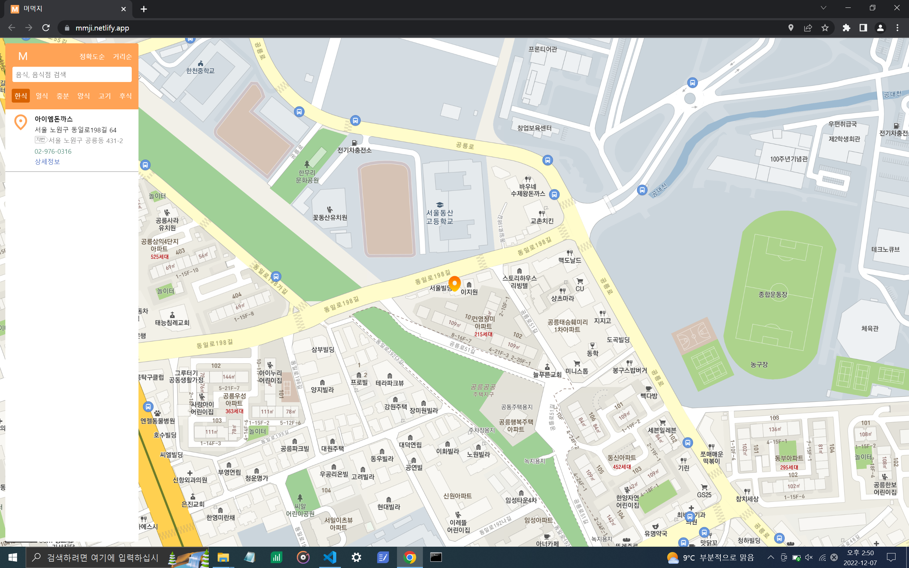
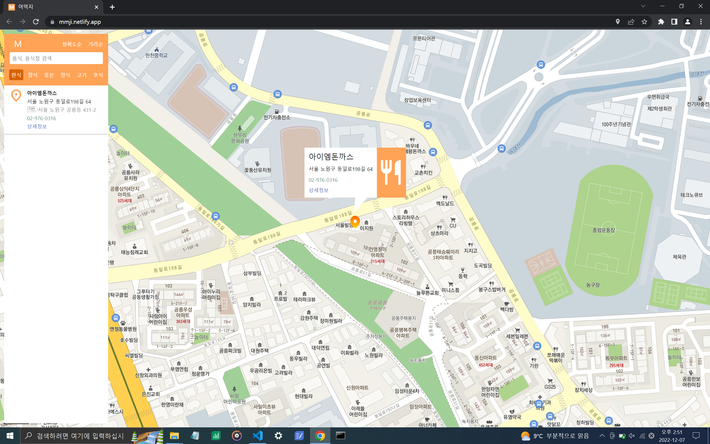

# 뭐먹지

</img>

[공릉동 맛집 추천 사이트 MMJ][mmj]

[mmj]: https://mmji.netlify.app

## 개요

- 공릉동에 존재하는 음식점들을 검색하고 추천하는 웹사이트

</img>

## 기능

- 위치기반으로 사용자 근처 1km내의 음식점,음식 을 정확도,거리순으로 검색

- 공릉동에 존재하는 음식점들을 한식,일식,중식/분식,양식,후식 카테고리별로 랜덤하게 추천

## 사용

### 사전준비

- 위치 허용(허용하지 않을 시 검색기능이 정확하게 작동하지 않음)

</img>

### 검색

- 원하는 음식점이나 음식을 검색(우측상단의 버튼을 누르면 정확도,거리순으로 목록이 정렬)

</img>

### 랜덤 맛집 추천

- 원하는 카테고리의 버튼을 누르면 랜덤하게 카테고리의 맛집을 표시

</img>

### 조작

- 리스트 항목에 마우스를 올리면 마커에 해당 음식점 표시, 마우스를 떼면 마커 제거

- 지도의 마커를 클릭하면 음식점 정보 표시, 정보창 우측의 음식점 마크를 클릭하면 마커 제거

</img>

## 참고

- [markdown작성법 참조][marklink]
  [marklink]:https://gist.github.com/ihoneymon/652be052a0727ad59601

- [실시간위치 코드참조][marklink]
  [marklink]:https://7942yongdae.tistory.com/150

- [카카오api문서 참조][marklink]
  [marklink]:https://apis.map.kakao.com/web/documentation/

- [장소검색 라이브러리 코드 참조][marklink]
  [marklink]:https://7942yongdae.tistory.com/150

- [커스텀 오버레이 코드 참조][marklink]
  [marklink]:https://apis.map.kakao.com/web/sample/removableCustomOverlay/
